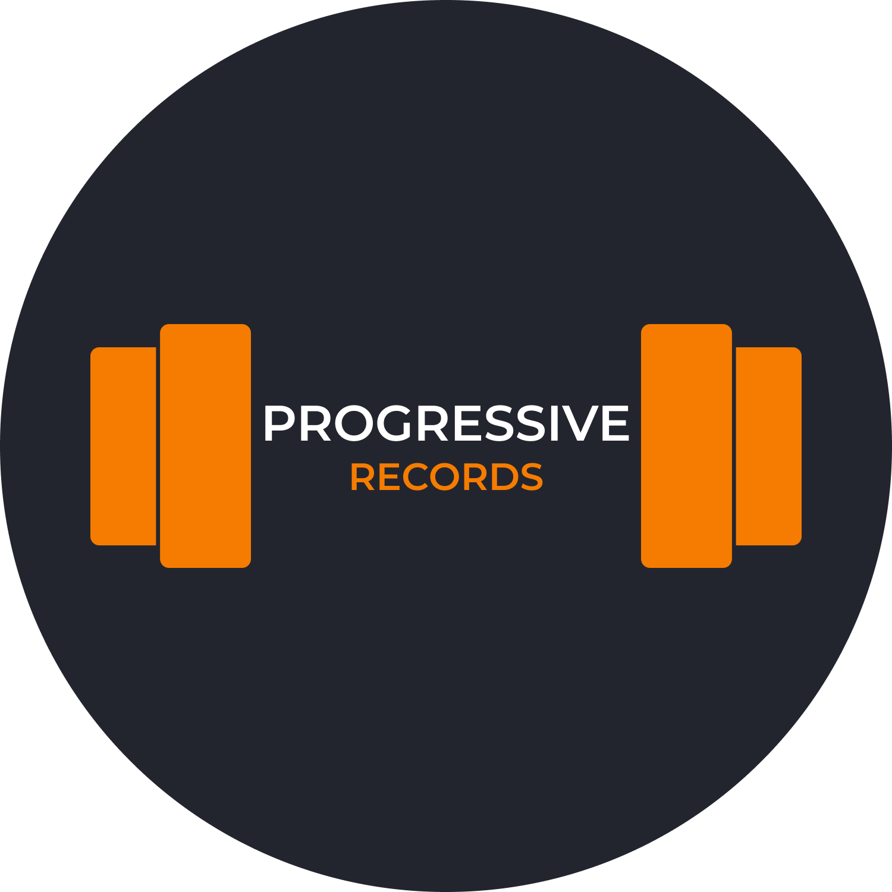

## Progressive Records

  

Progressive Records is a fast, simple and efficient training log application for Android devices.

It allows you to track you progress in all kinds of exercises, shipping with a pool of 262 different ones and allowing you to add your own. 

Create templates, check your history and view your progress over time, all with a simple and unobtrusive UI for you to focus on what is important: training.

  
  

Available in 3 languages: English, Spanish and Catalan, with light and dark themes.

## Installation
Simply download the apk from the [releases page](https://github.com/Nanukr/ProgressiveRecords/releases/tag/Latest) and execute it in your Android device.
